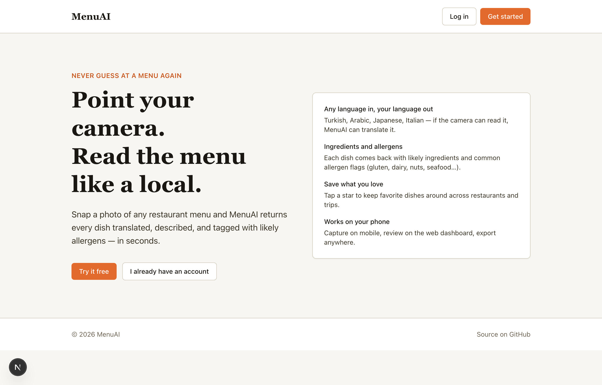
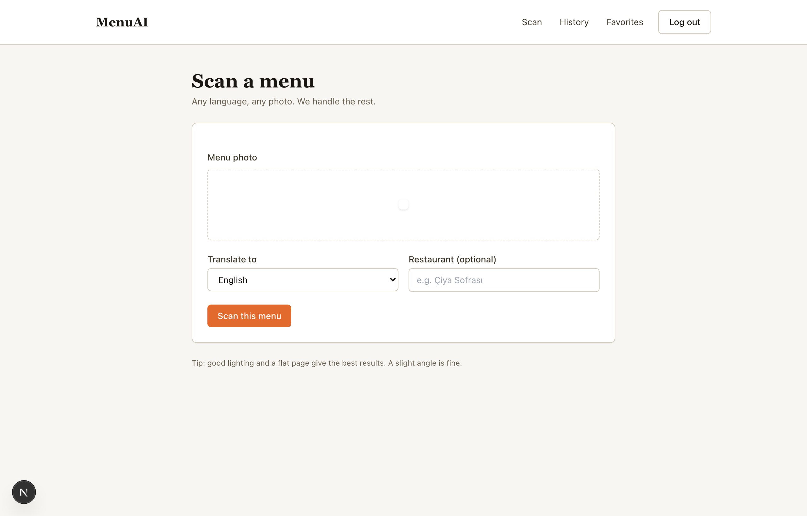
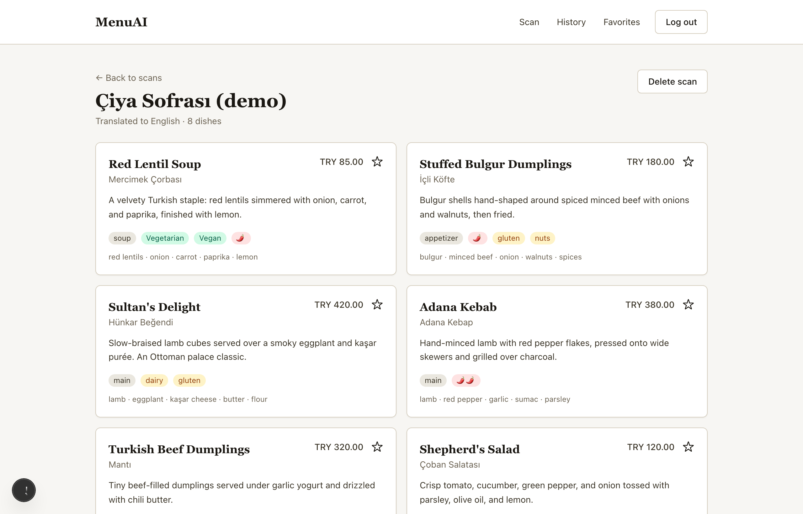
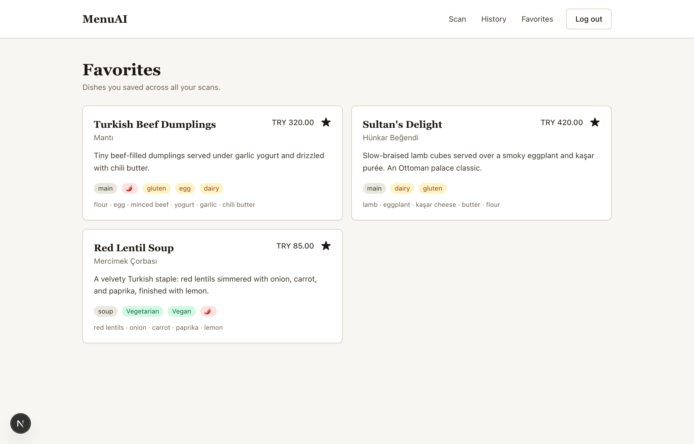
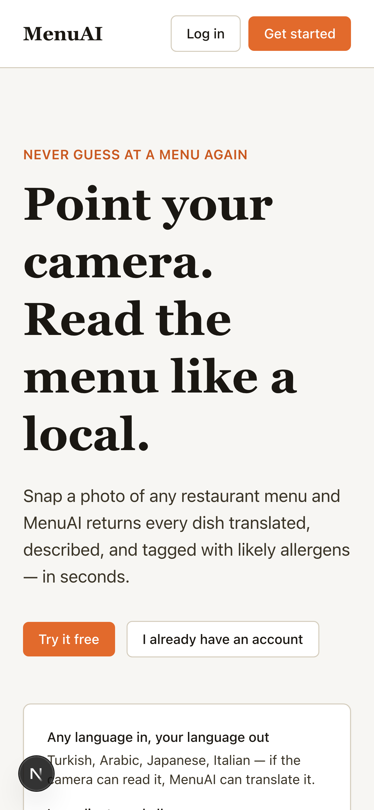
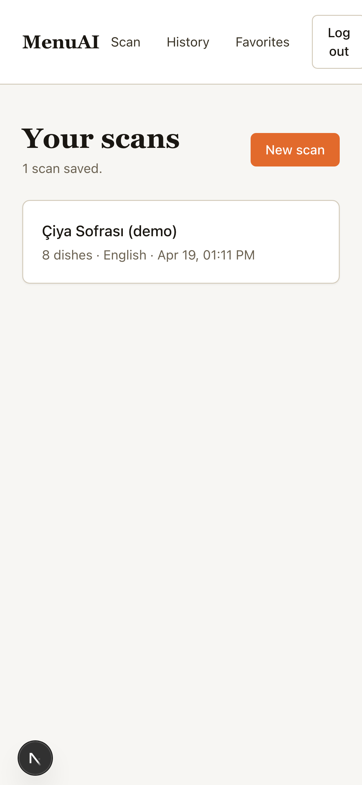
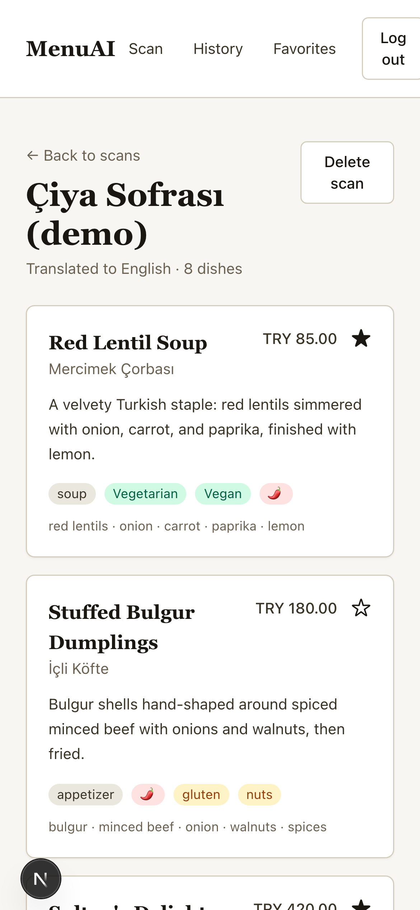

# MenuAI

[](https://github.com/shahabRDZ/menuai/actions/workflows/backend.yml)
[](https://github.com/shahabRDZ/menuai/actions/workflows/web.yml)
[](https://github.com/shahabRDZ/menuai/actions/workflows/mobile.yml)

**Snap a photo of any restaurant menu → get every dish translated, described, and labeled with allergens.**

Living in Istanbul, reading a Turkish menu one line at a time through a translation
app gets old fast. The whole flow — photograph, translate dish by dish, guess the
allergens — should collapse into a single action. That's MenuAI.



## Screens

| Capture | Review | Keep |
|---------|--------|------|
|  |  |  |

Works just as well on mobile:

<p>
  
  
  
</p>

## What it does

- **Scan** — point the camera at a menu, get the whole thing parsed in seconds
- **Translate** — natural translations, not dictionary-level word substitutions
- **Describe** — 1–2 sentence description for each dish, even when the menu has none
- **Tag** — ingredients, allergens, vegetarian/vegan, spice level
- **Save** — star your favorite dishes across restaurants and trips

## Stack

| Layer   | Tech                                                                    |
|---------|-------------------------------------------------------------------------|
| Backend | FastAPI, async SQLAlchemy, PostgreSQL, Alembic, JWT, Redis              |
| Web     | Next.js 15 (App Router, Server Components), TypeScript, Tailwind        |
| Mobile  | Flutter 3, Provider, flutter\_secure\_storage, image\_picker            |
| Vision  | Anthropic vision model with prompt caching on system prompts            |
| Infra   | Docker Compose, GitHub Actions                                          |

## Architecture

```
     ┌──────────────┐         ┌──────────────┐
     │  Mobile app  │         │  Web app     │
     │  (Flutter)   │         │  (Next.js)   │
     └──────┬───────┘         └──────┬───────┘
            │   REST + JWT           │
            └──────────┬─────────────┘
                       ▼
              ┌────────────────────┐
              │  FastAPI backend   │
              │  ──────────────    │
              │  routers/          │
              │  services/         │
              │  repositories/     │
              │  models/           │
              └────┬─────────┬─────┘
                   │         │
        ┌──────────▼───┐  ┌──▼─────────────────┐
        │ PostgreSQL   │  │ Anthropic Vision   │
        └──────────────┘  └────────────────────┘
```

The backend uses a clean layered architecture: models → repositories → services → routers.
Each layer has a single responsibility and services are injected via FastAPI's DI system,
which keeps controllers thin and tests easy to write.

## Repo layout

```
menuai/
├── backend/           FastAPI service (see backend/README.md)
├── web/               Next.js 15 app (see web/README.md)
├── mobile/            Flutter app (see mobile/README.md)
├── docker-compose.yml
└── .github/workflows/ backend / web / mobile CI
```

## Quick start

```bash
cp .env.example .env
# optional: add ANTHROPIC_API_KEY — with an empty key the stack runs in
# demo mode and returns a canned Turkish menu fixture instead of calling
# the vision model.

docker compose up --build
docker compose exec api alembic upgrade head

# in another terminal
cd web && cp .env.example .env.local && npm install && npm run dev
```

- API → http://localhost:8000 (docs: `/docs`)
- Web → http://localhost:3000

Mobile — see [`mobile/README.md`](./mobile/README.md) for simulator vs device setup.

### Demo mode vs live mode

| Mode  | `ANTHROPIC_API_KEY` | Behavior                                               |
|-------|---------------------|--------------------------------------------------------|
| Demo  | empty / unset       | Returns a canned multi-language Turkish menu fixture   |
| Live  | `sk-ant-...`        | Calls the Anthropic vision model to parse real photos  |

Demo mode is what powered the screenshots above — the entire product works
end-to-end with no external calls.

## Deploy

See [`docs/deploy.md`](./docs/deploy.md) for a step-by-step guide to deploying on
Railway (backend) and Vercel (web).

## Demo

See [`docs/demo.md`](./docs/demo.md) for a 5-minute walkthrough script — what to
show, in what order, and what to say.

## License

MIT
